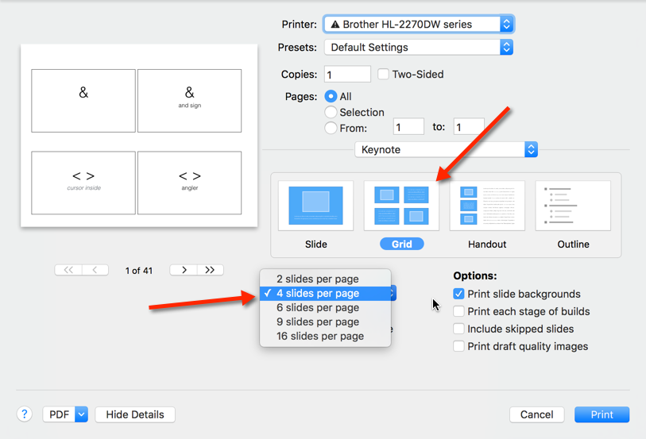

# voicecode flashcards

The keynote slides can be used interactively on your Mac or printed out on paper.

## printing

You can print flashcards in sets of 1, 2, or 8. Then get out your scissors :)

## reference

 - https://voicecode.io/
 - https://voicecode.gitbooks.io/voicecode/content/